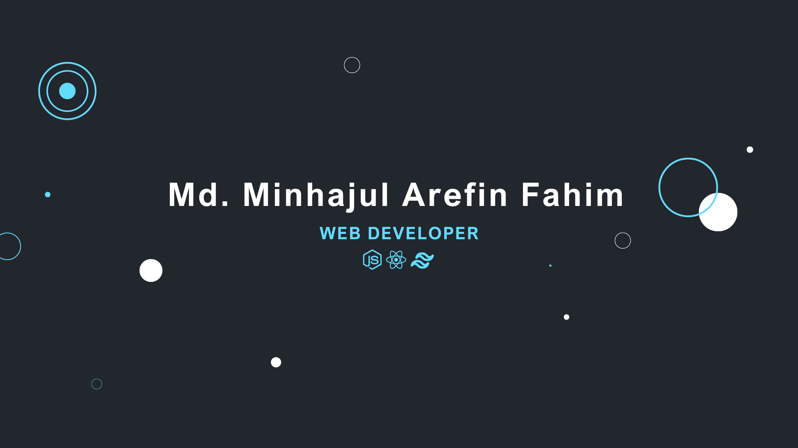

<h1 align="center">Hello 😊</h1>

I am a dependable and committed individual with a keen interest and a firm understanding of web technology. I am actively seeking an opportunity to kickstart my career, eager to expand my skills as a professional web developer. Recently, I acquired proficiency in MERN stack technologies and applied my knowledge through various projects. I possess logical thinking skills and adaptability. Additionally, I thrive in collaborative environments, prepared to make meaningful contributions as a team player.

- 📍 Currently residing in Dhaka, Bangladesh
- 📬 Reach out to me at minhajul.arefin.fahim@gmail.com
- 🛠️ Already proficient in MERN technologies
- 🚀 Currently enhancing my skills with TypeScript and Next.js
- 🤝 I'm available for collaboration on React and Node projects.
- 📄 Explore my resume here: [https://drive.google.com/drive/folders/13kfMv2zPc8EX1Y5ihFPnTdRQGuCYGooV?usp=sharing](https://drive.google.com/drive/folders/13kfMv2zPc8EX1Y5ihFPnTdRQGuCYGooV?usp=sharing)

<h2 align="center">My Stats:</h2>

  

  

  
  

<h2 align="center">My Skills:</h2>

  

  

  

<h2 align="center">Connect with me:</h2>

  

